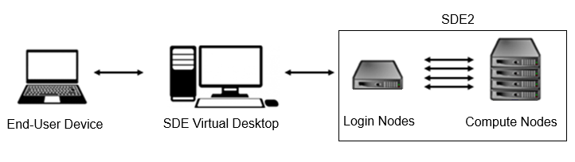
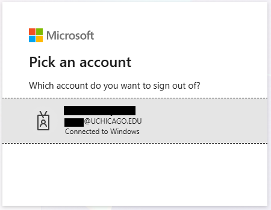
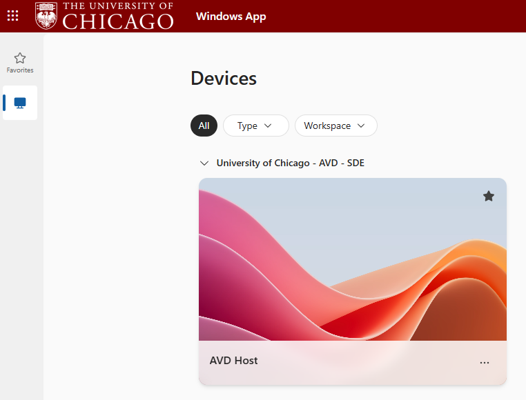
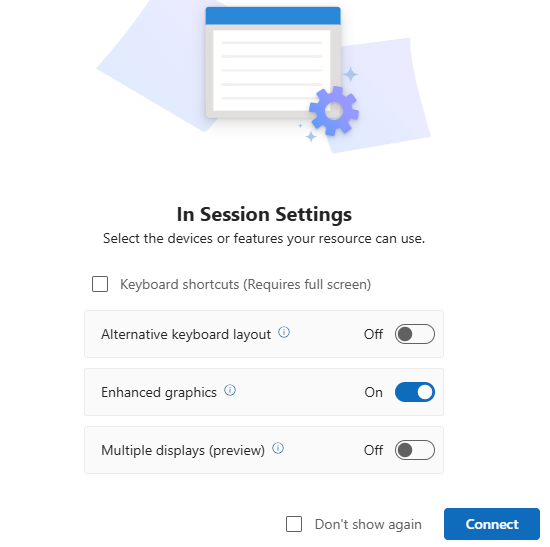
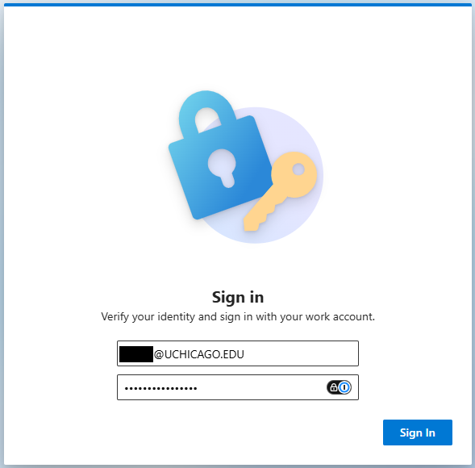
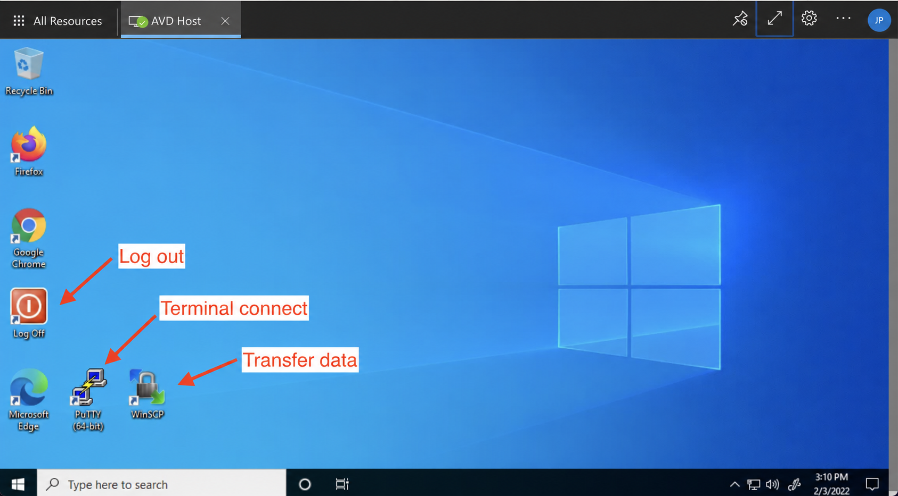
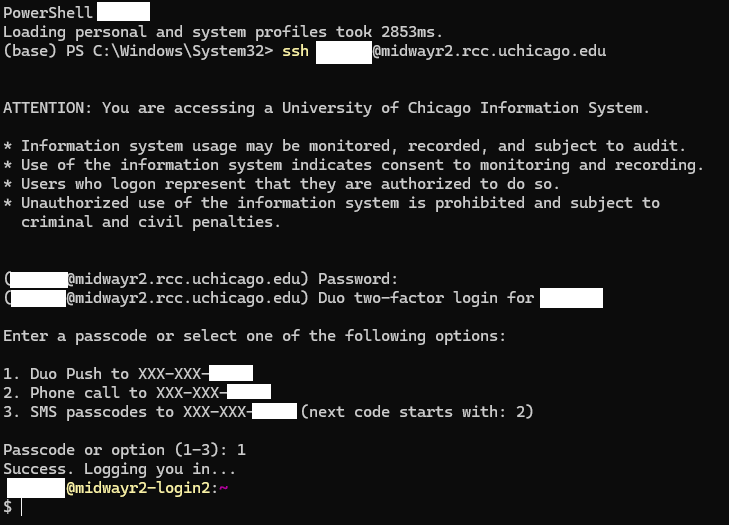
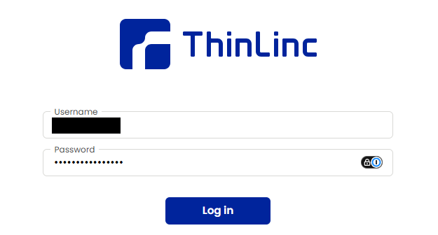
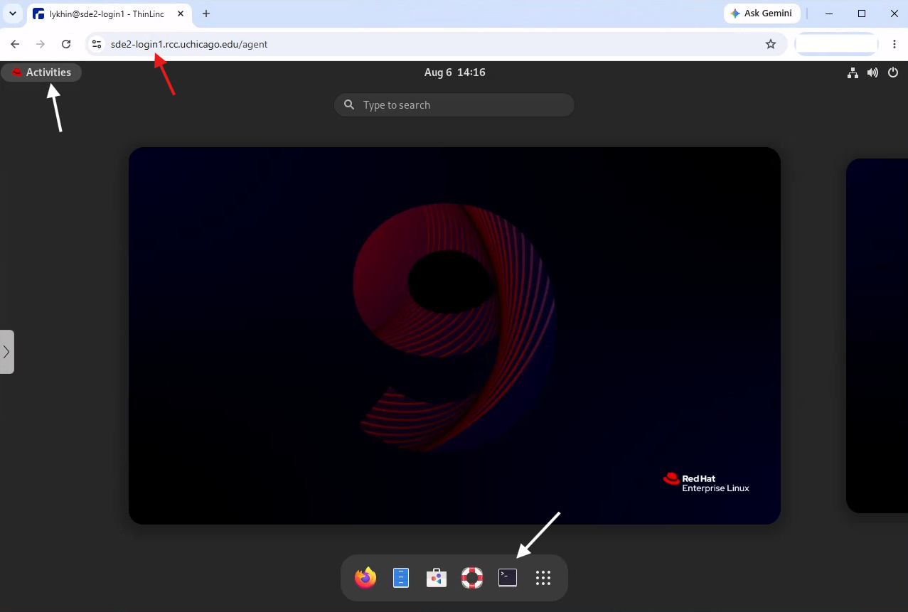
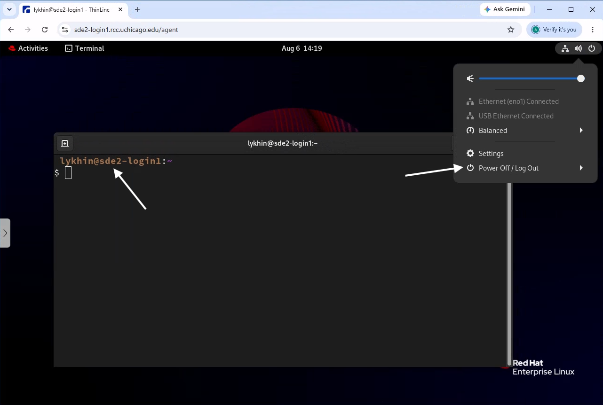

# Connection
Direct connection from the end-user devices to SDE2 is restricted. Instead, users are expected to establish a connection to the secure SDE Desktop and only then authenticate to SDE2. The SDE Desktop serves as a secure Windows-based gateway to the Linux-based SDE2 HPC environment.   

{ width="1000" }

## STEP 1: From a Local Device to the SDE Desktop 
### Web Browser
Navigate to [https://rdweb.wvd.microsoft.com/arm/webclient](https://rdweb.wvd.microsoft.com/arm/webclient) on your computer's web browser.
You will be prompted for UChicago credentials and a second factor of authentication:

{ width="700" }  

Add "AVD Host" workspace. You should then be able to launch the SDE Virtual Desktop in the browser:  
{ width="700" }  
{ width="700" }  
{ width="700" }  

After logging in, you will arrive at the SDE Virtual Desktop where you can launch various applications. Note this is not the SDE2 system, but rather a secure intermediate gateway:

{ width="1000" }

## STEP 2: From the SDE Desktop to the SDE2 System
There are several ways to connect to SDE2 from the SDE Desktop.

### Command Line Interface (SSH)
Open Powershell and run "ssh cnetid@sde2.rcc.uchicago.edu" or configure and save session in PuTTy:   
{ width="1000" }
  

### Graphical User Interface (GUI)
ThinLinc is a remote desktop server application. It is recommended to
use ThinLinc when you run software that requires a graphical user
interface, or "GUI" (e.g., Stata, MATLAB). To use ThinLinc to connect
to SDE2, please take the following steps on the SDE desktop:

1. Open a browser of your choice within the SDE Desktop. This browser will be running on the SDE Desktop which itself is nested into your local browser running on your end-user device. Inside this nested browser, enter the SDE2 ThinLinc URL: `https://sde2.rcc.uchicago.edu` in the address bar.

2. Enter your CNetID credentials and complete two-factor authentication on the ThinLinc login page:  
{ width="400" }
  

3. If the login process is successful, you will see a Linux desktop environment. To access the command-line shell, select the Applications menu, then the Terminal icon:  
{ width="1000" }
  

4. After selecting the Terminal icon, a Terminal window will appear. The console prompt shows the name of the login node you are connected to.
To exit ThinLinc, type `exit` in any Terminal window, then select the top-right icon, choose "Log Out", and follow the instructions. Finally, close the browser window.  
!!! warning
    Once logged off, any data stored in your AVD user-space will be purged.
    
{ width="1000" }   

