# Connection
The SDE3 system is accessed over the end-to-end encrypted network. Users first establish a connection to the SDE Desktop and then authenticate to SDE3 from within the SDE Desktop. The SDE Desktop serves as a secure Windows-based gateway to the Linux-based SDE3 HPC environment. Data cannot be transferred directly from SDE3 to end-user devices.  

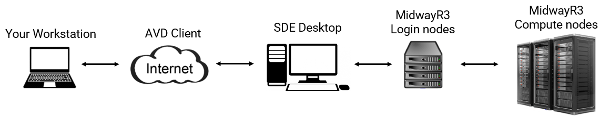{ width="1000" }

## STEP 1: From Local Machine to SDE Desktop 
### Web Browser
Navigate to [https://rdweb.wvd.microsoft.com/arm/webclient](https://rdweb.wvd.microsoft.com/arm/webclient) on your computer's web browser.
Select "AVD Host" to launch the Virtual Desktop:

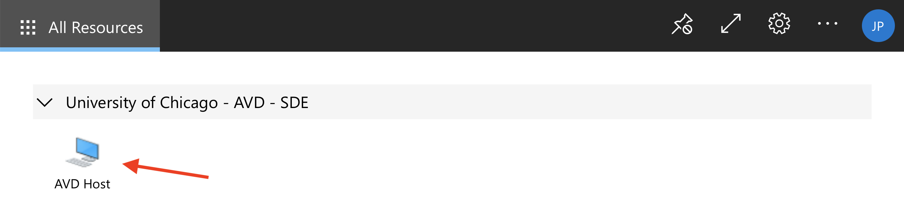{ width="1000" }

You will be prompted for your username (cnetID@uchicago.edu) and password:

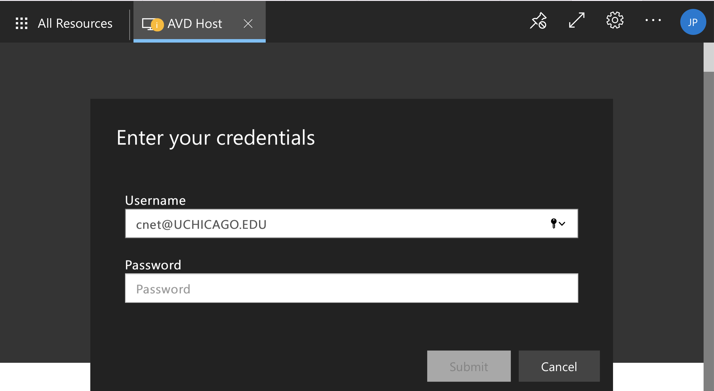{ width="1000" }

After logging in, you will arrive at the Desktop where you can launch applications:

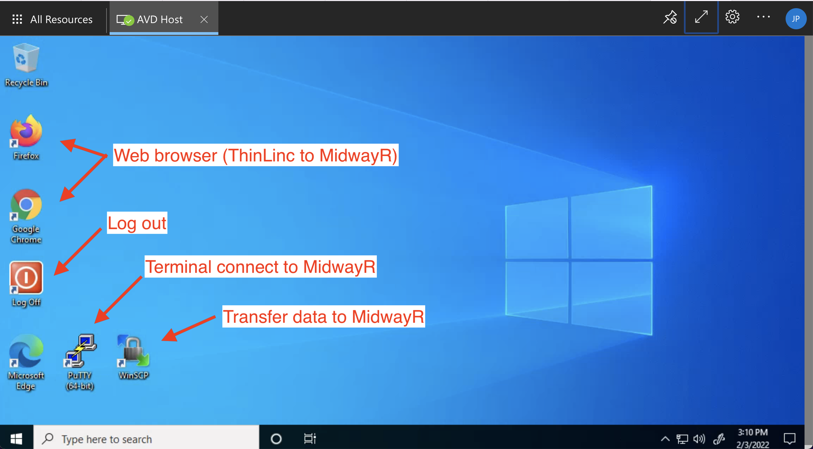{ width="1000" }

## Microsoft Remote Desktop Client
You can also connect from the Microsoft Remote Desktop App, available for download on the Windows or MacOS app store.
After launching the app, click on the "+" symbol and select "Add Workspace":

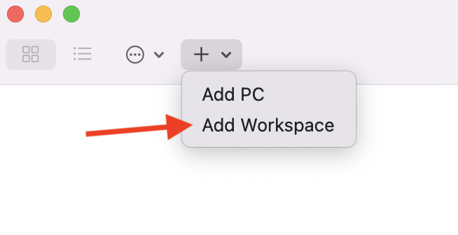{ width="500" }

In the dialog box, put the URL
"https://rdweb.wvd.microsoft.com":

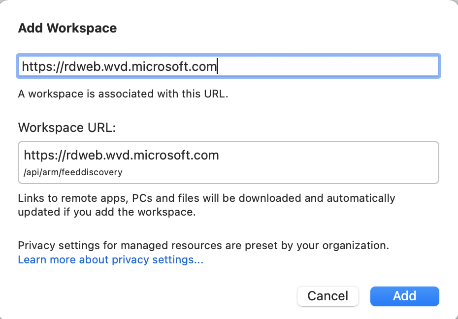{ width="700" }

Users do not need to be connected to UChicago VPN when lending on SDE Desktop. 

## STEP2: From SDE Desktop to SDE3
Once you are connected to the SDE environment using the AVD client following the steps given above, please follow one of the methods below to connect to SDE3 from the SDE environment.

### SSH Client
You can use Powershell or PuTTy terminal to connect to SDE3. Run the following command: ssh <cnetid>@sde.rcc.uchicago.edu:   
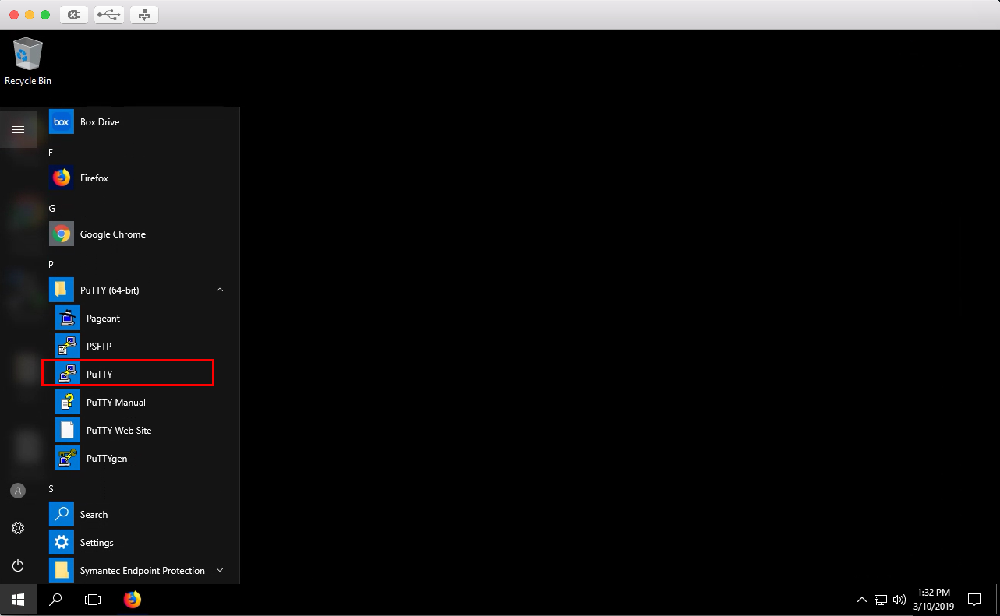
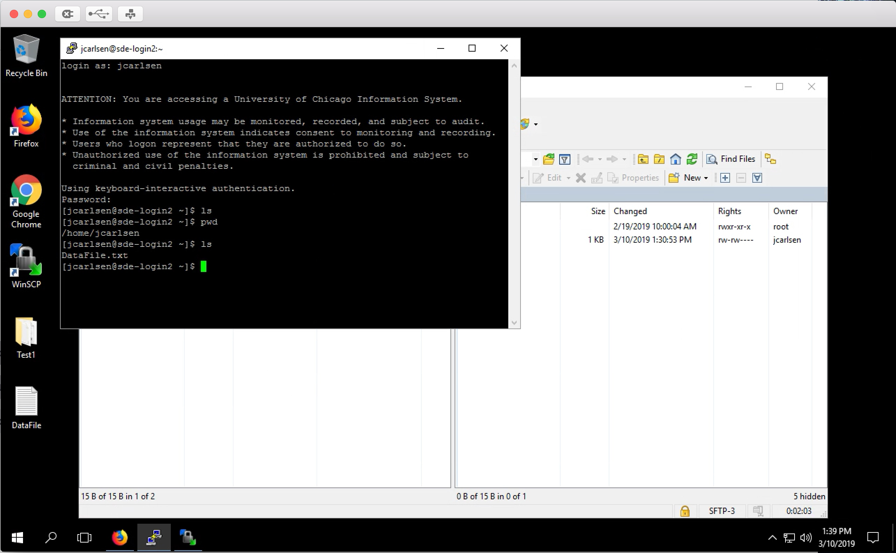
  

### ThinLinc

ThinLinc is a remote desktop server application. It is recommended to
use ThinLinc when you run software that requires a graphical user
interface, or "GUI" (e.g., Stata, MATLAB). To use ThinLinc to connect
to SDE3, please take the following steps on the SDE desktop:

1. Open a browser (Chrome or Firefox) and enter
   `https://sde.rcc.uchicago.edu` in the address bar.

2. Enter your CNetID and password on the ThinLinc login page:  
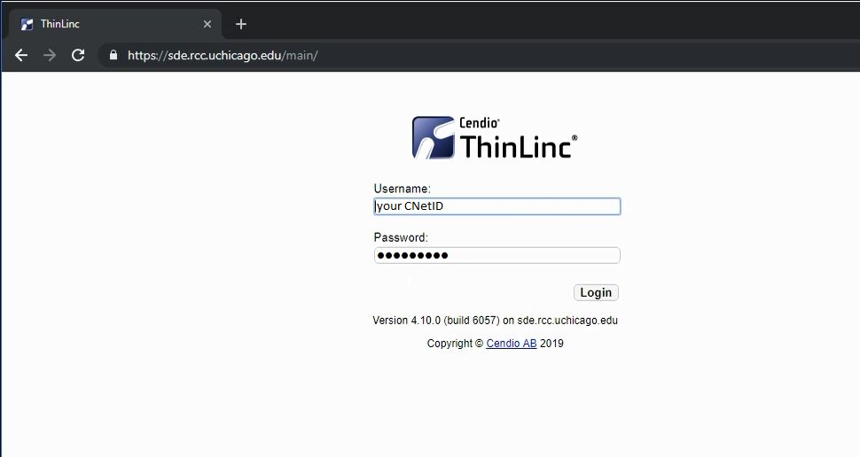
  

3. Follow the two-factor authentication prompts:  
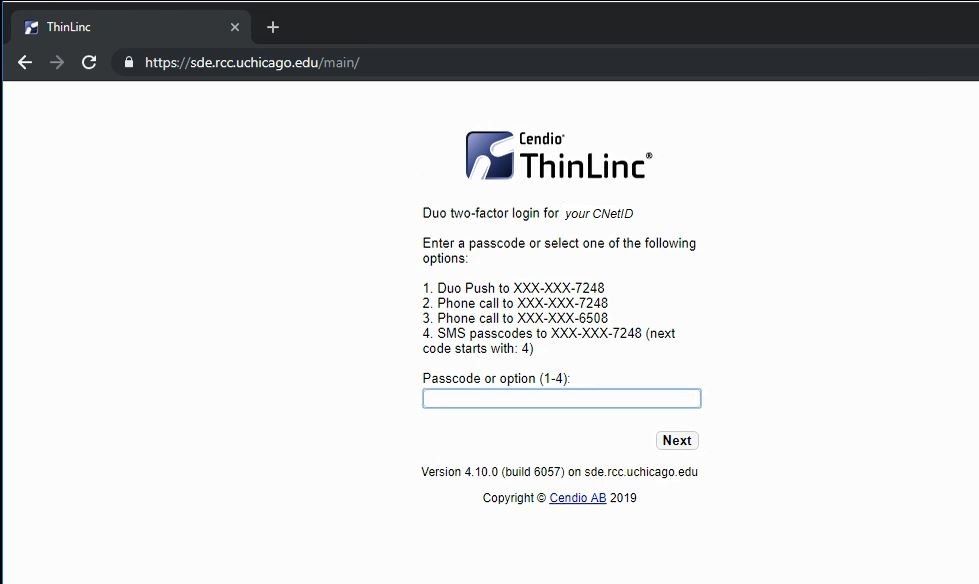
  

4. If the login process is successful, you will see a Linux desktop environment. To access the command-line shell, select the Applications menu, then the Terminal icon:  
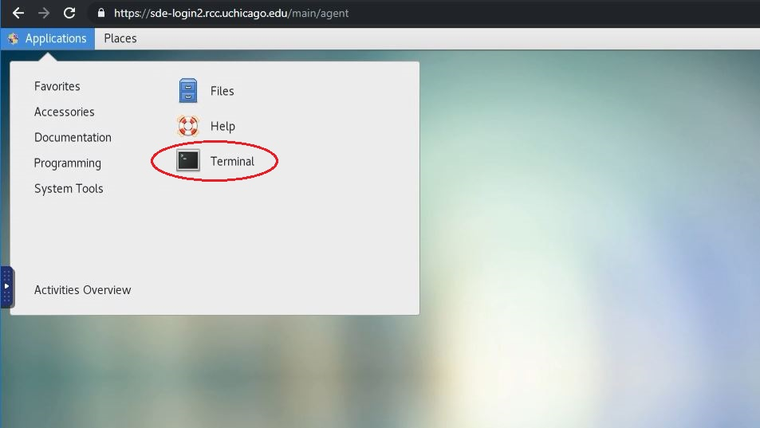
  

5. After selecting the Terminal icon, you should see a Terminal window appear. Typically this will give a console prompt showing which login node you are connected to:  
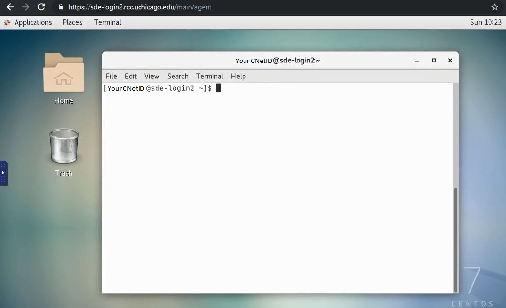
  

To exit ThinLinc, type `exit` in any Terminal window, select the top-right icon, then select the "Log Out" menu item and follow the instructions. Finally, close the browser window.  
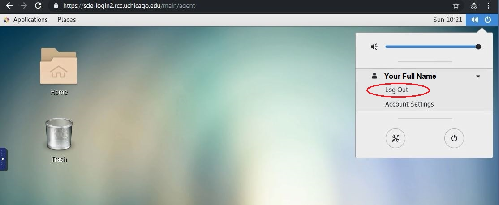   

## Logging Out
You can log out of the AVD by clicking the "Log off" application on the Desktop.
!!! warning
    Once logged off, any data stored in your AVD user-space will be purged.

